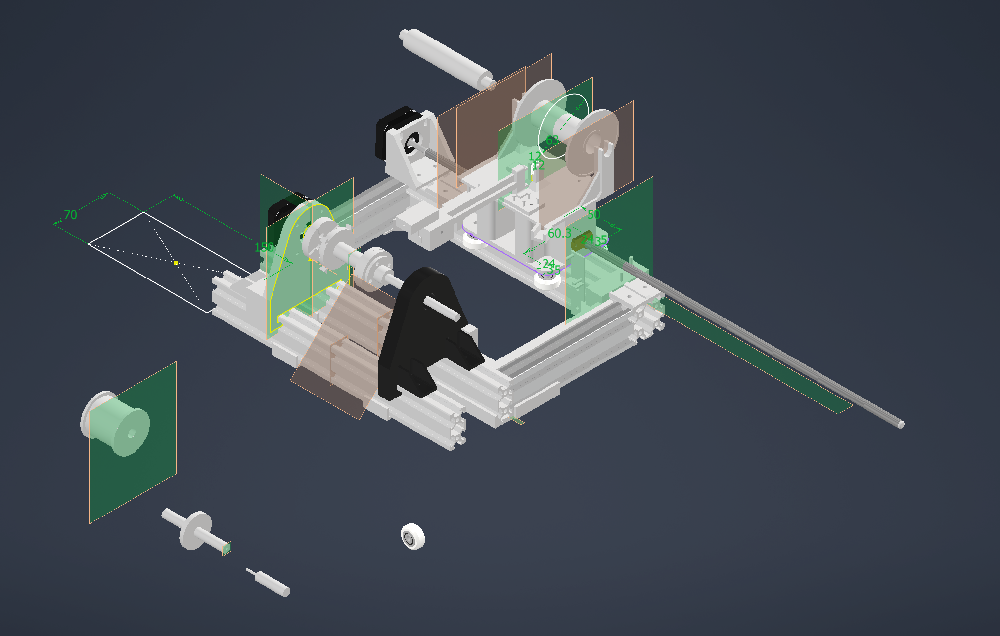

# CubeSat Magnetorquer Coil-Winding System

Automated coil-winding hardware and embedded control system built for the Perth Aerospace
Student Team's CubeSat, to produce magnetorquers for the attitude determination and control
(ADCS) subsystem. Designed and 3D-printed a custom mechanical chassis with dual-stepper
actuation, and developed the embedded firmware to drive the steppers and integrate limit
switches for precise wire-laying.

**Status:** Currently in the build/testing phase — has successfully wound coils, not yet at
production-usable output.

## My contribution

This was a team project. I designed the mechanical chassis and was the primary developer of
the winder's control firmware.

- Full code: https://github.com/PerthAerospaceStudentTeam/Coil_Winder_Code

## Renders

